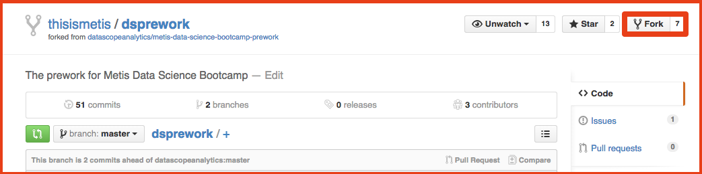
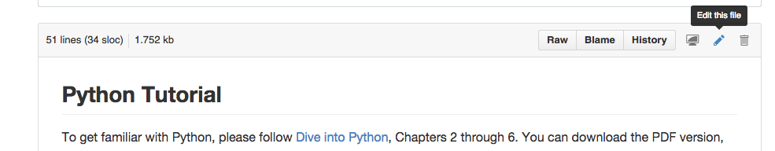
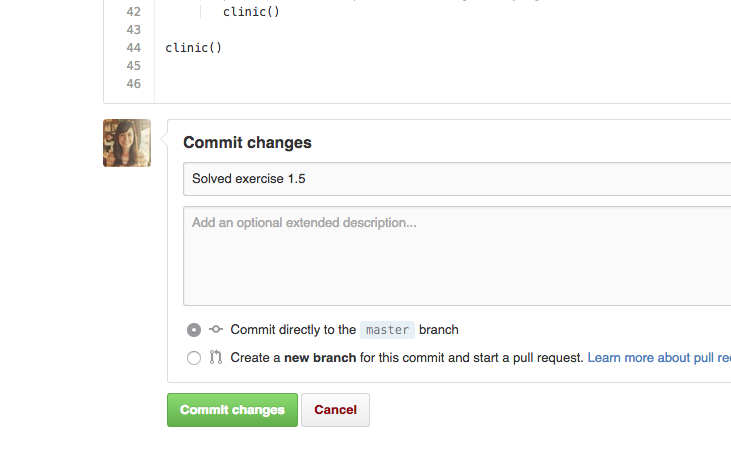

# Set up your repository on GitHub

## Step 1: Sign up for GitHub

You will need a GitHub account.

It's easy and free to [sign up](https://github.com/join).

## Step 2: Sign in to GitHub

Make sure that you are [signed in](https://github.com/login) to GitHub.

## Step 3: Fork this repository

Click the **Fork** button at the upper right hand corner of the page:

This makes a personal copy of the repository that you can edit. Your forked copies will show up in your *Repositories* section.

This repository is `thisismetis/dsprework`. Your forked copy will be `your_github_user_name/dsprework`.

## Step 4: Edit your fork

There are files in your forked repository that you need to edit to add your work.

When viewing an individual file in your forked repository on GitHub, you will an see "Edit this file" button that you can click to get an in-browser editor.

After you've edited the file, you need to _commit_ your changes to make them permanent. At the bottom of the page you can add a _commit message_ describing your changes and then click the green "Commit changes" button.

You can repeat the edit and commit process as many times as you like. You don't have to be totally done with a file to commit. Commit incrementally!

Here's your first chance to practice this:

---

What is your favorite [emoji](http://www.emoji-cheat-sheet.com/)?

REPLACE THIS TEXT WITH YOUR RESPONSE

---

### Deepen your knowledge

The process above is designed to be accessible to anyone regardless of background. There is much more to learn about `git` and GitHub.

To get a complete understanding of `git`, you should read [Pro Git](http://git-scm.com/book/en/v2). It's available free online or as a printed book.

It isn't required, but you can also submit work to your forked repository by `clone`ing your fork, editing files on your machine, `add`ing them to the staging area, `commit`ting them, and `push`ing your changes back up to GitHub.
